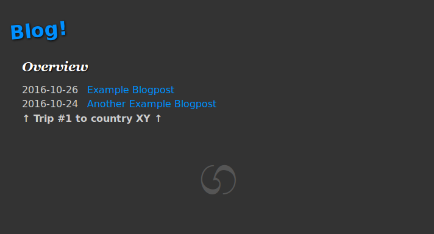
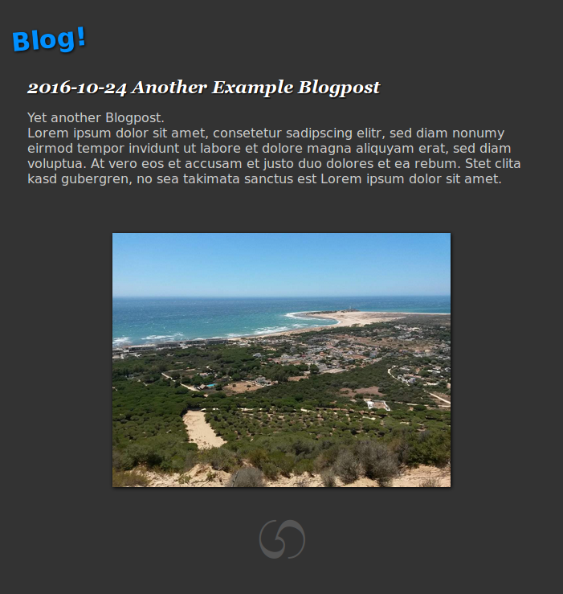

# minimalistic-travelblog
Very minimalistic travelblog for Linux-shell-users (no convenient upload form so far)

## Features
* based on PHP, no database, no included libraries
* simple responsive design
* created subfolders serve as a blogposts
* blogpost contains
    * text (formatting via plain HTML)
    * images are automatically put below text
    * animated image zoom on hover via CSS3

## Requirements
* SSH or FTP access to your webserver with PHP5+ support
* optional
    * basic HTML skills for formatting
    * CSS skills for layout customizations

## Screenshots
Overview-page of the blog:

Example blogpost (images are enlarged to window width when hovered):

## Installation
1. clone the repo or download the files
2. adjust the `index.php` to your needs
    * blog title (title element in head and in style element: #h1:after)
    * website language (html element lang=...)
    * delete or adjust the separation at the end of the file (trip #1, etc)
4. upload only the index.php to webserver and create a blogpost (or create it in advance and upload both)
5. adjust permissions/owner

## How to post a new blogpost
1. prepare your text and images
    * write your text into a textfile called `text` in UTF-8
    * convert your selected images via a small supplied shellscript to the right size, see subfolder `imageconversion`, adjust the size and quality to your needs. I recommend sizes over 1024px in width. Usage: `$ blogpicconvert.sh folderwithpicsinit`, all pics will be overwritten within the given folder
2. create a new subfolder in the blog directory
    * folder name serves as title of blogpost (e.g. "2016-10-26 Arrival at XY")
3. upload "text" and your images to the new subfolder via SCP
4. change the permissions/ownership of the files to be readable by the webserver
5. enjoy your new blog without schnickschnack!

## Further possible improvements
* upload form
    * simple authentification with password
    * with image conversion
* install script
    * set title
    * set password
* templates
* ...